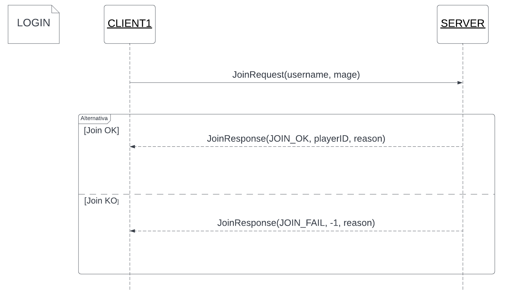
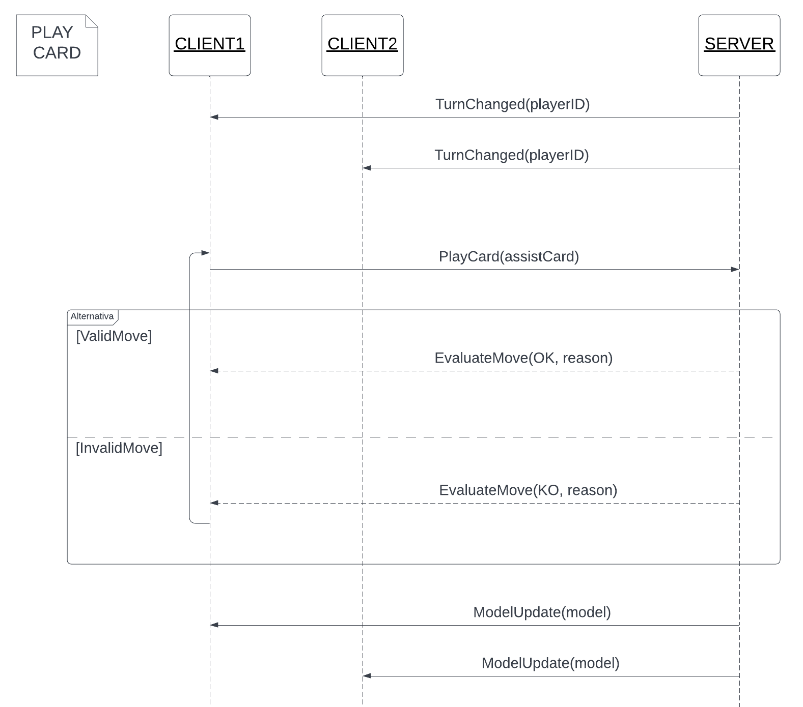
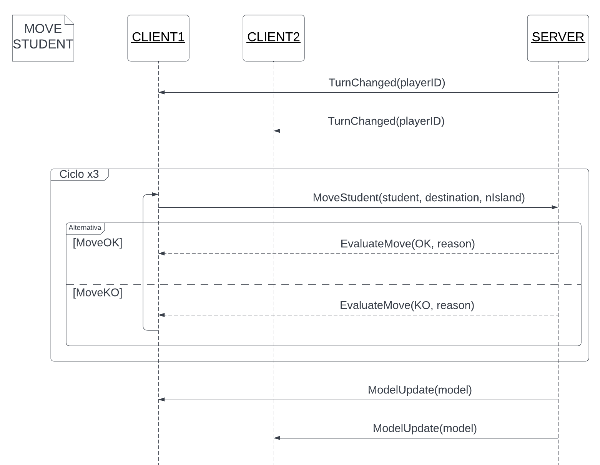
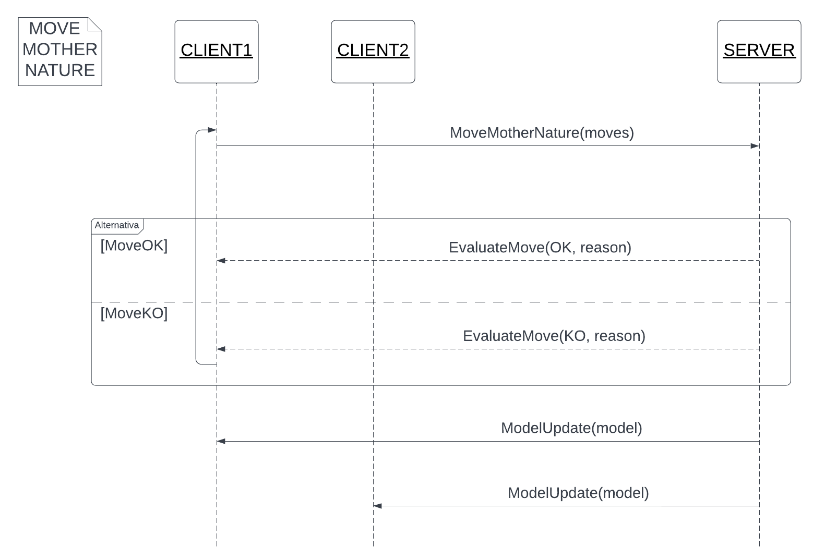
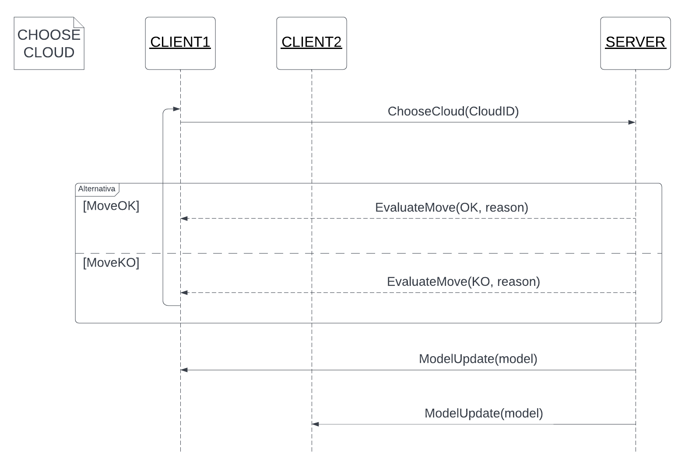
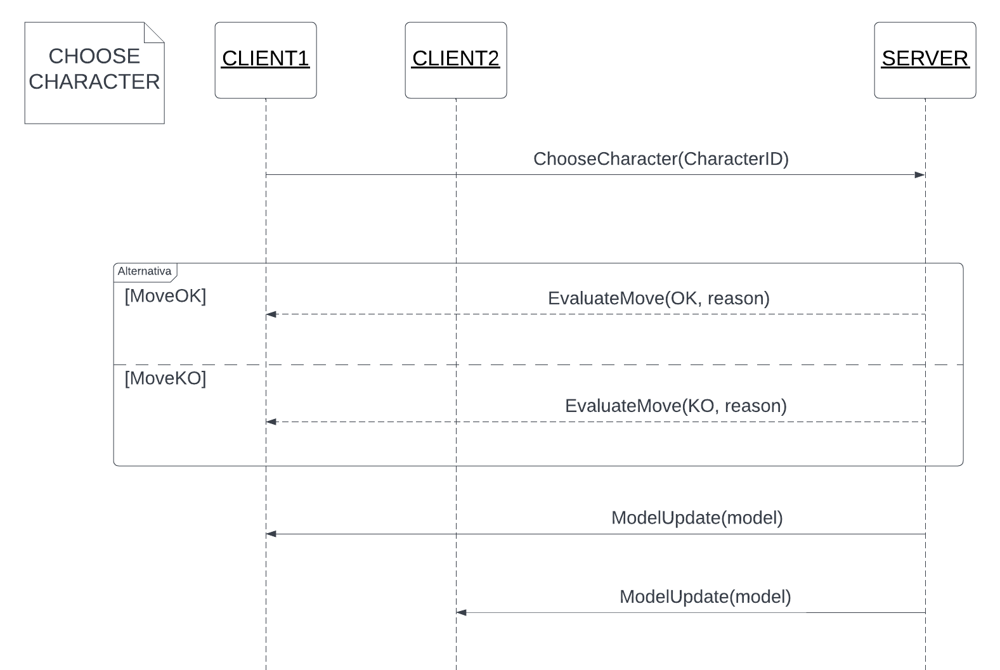
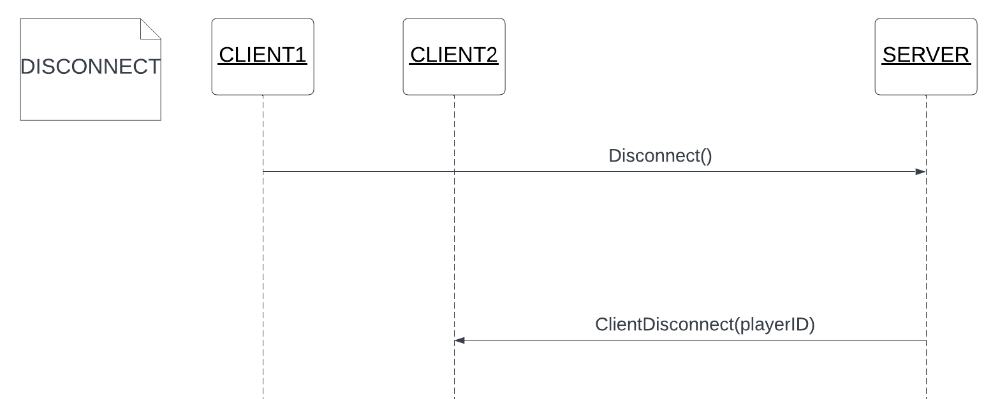

# Eriantys Protocol Documentation

Edoardo Fullin, Daniele Gazzola, Giacomo Groppi

Group 39

## Messages

### JoinRequest

Client requests to join the game

#### Arguments

 - username: player name
 - mage: chosen mage (MAGE_1, MAGE_2, MAGE_3, MAGE_4)

#### Possible responses

 - JoinResponse 

### JoinResponse

Server accepts/rejects the join request 

#### Arguments

 - respCode: JOIN_OK / JOIN_FAIL / JOIN_FAIL_USERNAME_TAKEN / JOIN_FAIL_MAGE_TAKEN ecc... 
 - playerId: assigned ID to the player requesting to join

#### Possible responses

 - none

### GameStarted (broadcast)

Server informs the clients that the game is started

#### Arguments

 - model: entire model (hiding opponents' hands and pouches)

#### Possible responses

 - none
 
### ModelUpdate

Sends the updated model to the client

#### Arguments

 - model: entire model

#### Possible responses

 - none
 
### PlayCard

Play selected card

#### Arguments

 - card: played card

#### Possible responses

 - EvaluateMoveResponse
 
### EvaluateMoveResponse

Server evaluates the player's move and decides whether it's legal or not.

#### Arguments

 - resp: OK / KO
 - reason: explanation string

#### Possible responses

 - none
 
### TurnChange (broadcast)

Server informs all clients about the ID of the players that needs to play

#### Arguments

 - currentPlayerTurnId: current player ID

#### Possible responses

 - none
 
### MoveStudent

Client moves a student

#### Arguments

 - studentColor: student to move
 - destination: CANTEEN / ISLAND
 - nIsland: island to move to

#### Possible responses

 - EvaluateMoveResponse

### MoveMotherNature

Client moves mother nature

#### Arguments

 - moves: number of moves

#### Possible responses

 - EvaluateMoveResponse

### ChooseCloud

Client chooses which cloud to get students from

#### Arguments

 - cloud: cloud's id

#### Possible responses

 - EvaluateMoveResponse
 
### ChooseCharacter

Client chooses a character

#### Arguments

 - character: character's name

#### Possible responses

 - EvaluateMoveResponse
 
### GameEnded (broadcast)

Server ends the game notifying all clients about who won

#### Arguments

 - winner: winner's id

#### Possible responses

 - none

### Disconnect

Client disconnects

#### Arguments

- none

#### Possible responses

- none

### ClientDisconnect (broadcast)

Server informs other clients about a disconnection

#### Arguments

- client: player's id

#### Possible responses

- none

### Ping

Server to client

#### Arguments

- none

#### Possible responses

- Pong

### Pong

Client to server

#### Arguments

- none

#### Possible responses

- none

## Scenarios

### LOGIN

Player asks server to join the game;
server accepts or refuses request.

### PLAY CARD

Server notifies all clients about current player;
Current player chooses which card to play;
Server replies whether the move is valid or not;
Server updates all clients.

### MOVE STUDENT

Server notifies all clients about current player;
current player chose which student to move and where;
Server replies whether the move is valid or not;
Server updates all clients.

### MOVE MOTHER NATURE

Current player chooses where to move mother nature;
Server replies whether the move is valid or not;
Server updates all clients.

### CHOOSE CLOUD

Current player chooses a cloud;
Server replies whether the move is valid or not;
Server updates all clients.

### CHOOSE CHARACTER

Current player chooses a character;
Server replies whether the move is valid or not;
Server updates all clients.

### DISCONNECT

Player notifies disconnection;
Server updates all clients.